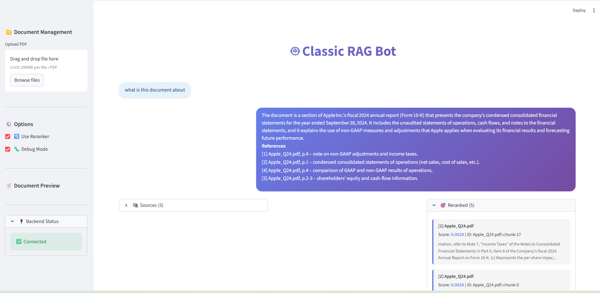
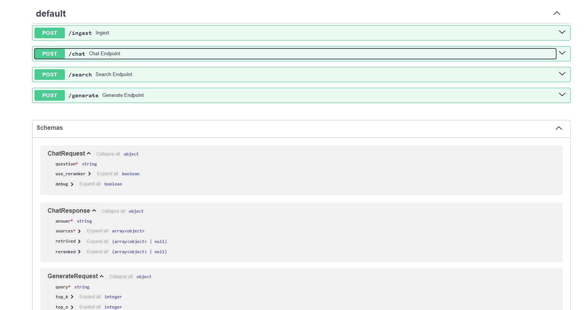

# 🤖 Classic RAG - Retrieval Augmented Generation

A complete RAG system for document Q&A with semantic search, reranking, and AI-powered answers.

**Tech Stack:** FastAPI • Streamlit • Pinecone • OpenAI • Groq • Cohere

---

## 🏗️ Architecture

```
┌─────────────────────────────────────────────────────────────────┐
│                      USER INTERFACES                             │
│  ┌──────────────────────┐         ┌──────────────────────────┐ │
│  │  Streamlit Frontend  │         │   FastAPI Swagger UI     │ │
│  │  (Chat Interface)    │         │   (REST API)             │ │
│  └──────────┬───────────┘         └──────────┬───────────────┘ │
└─────────────┼────────────────────────────────┼─────────────────┘
              │                                │
              └────────────┬───────────────────┘
                           │ HTTP/REST
              ┌────────────▼─────────────┐
              │   FastAPI Backend        │
              │                          │
              │  • POST /ingest          │
              │  • POST /chat            │
              │  • POST /search          │
              │  • POST /generate        │
              └────────────┬─────────────┘
                           │
         ┌─────────────────┼─────────────────┐
         │                 │                 │
         ▼                 ▼                 ▼
┌────────────────┐  ┌─────────────┐  ┌──────────────┐
│   INGESTION    │  │  RETRIEVAL  │  │  GENERATION  │
│                │  │             │  │              │
│ • PDF Parser   │  │ • Embedding │  │ • LLM (Groq) │
│ • Chunking     │  │ • Search    │  │ • Context    │
│ • Embedding    │  │ • Reranking │  │ • Prompt     │
└───────┬────────┘  └──────┬──────┘  └──────────────┘
        │                  │
        └────────┬─────────┘
                 ▼
    ┌────────────────────────┐
    │  PINECONE VECTOR DB    │
    │  • Embeddings          │
    │  • Metadata            │
    │  • Similarity Search   │
    └────────────────────────┘
```

---

## 🔄 Data Flow

### Ingestion Pipeline
```
PDF Document
    ↓
Extract Text & Pages
    ↓
Clean & Normalize
    ↓
Chunk (512 tokens, 50 overlap)
    ↓
Generate Embeddings (OpenAI)
    ↓
Store in Pinecone (with metadata)
```

### Query Pipeline
```
User Question
    ↓
Generate Query Embedding (OpenAI)
    ↓
Search Pinecone → Retrieve Top 10 Chunks
    ↓
Rerank (Cohere) → Select Top 5 Chunks
    ↓
Build Context + Prompt
    ↓
LLM Generation (Groq)
    ↓
Return Answer + Sources
```

---

## 📸 Screenshots

### Streamlit Chat Interface


*Modern chat interface with expandable sources, retrieved results, and reranked results*

### FastAPI Swagger Documentation


*Interactive REST API documentation with all endpoints*

---

## ⚡ Quick Start

### 1. Setup Environment
```bash
# Create virtual environment
python -m venv .venv
.venv\Scripts\activate

# Install dependencies
pip install -r requirements.txt

# Configure API keys (.env file)
OPENAI_API_KEY=your_key
PINECONE_API_KEY=your_key
GROQ_API_KEY=your_key
COHERE_API_KEY=your_key
PINECONE_INDEX_NAME=classic-rag-index
```

### 2. Start Backend API
```bash
python -m uvicorn app.api:app --reload --host 127.0.0.1 --port 8000
```
Access at: http://localhost:8000/docs

### 3. Start Frontend UI
```bash
streamlit run frontend/app.py
```
Access at: http://localhost:8501

---

## 📚 API Endpoints

| Endpoint | Method | Description |
|----------|--------|-------------|
| `/ingest` | POST | Upload and process documents |
| `/chat` | POST | Ask questions with AI answers |
| `/search` | POST | Search documents (no generation) |
| `/generate` | POST | Full RAG pipeline |
| `/docs` | GET | Swagger API documentation |

### Example Usage

**Ingest Document:**
```bash
curl -X POST "http://127.0.0.1:8000/ingest" \
  -H "Content-Type: application/json" \
  -d '{"filepath": "C:/path/to/document.pdf"}'
```

**Ask Question:**
```bash
curl -X POST "http://127.0.0.1:8000/chat" \
  -H "Content-Type: application/json" \
  -d '{"question": "What are the key findings?", "use_reranker": true}'
```

---

## 📁 Project Structure

```
classic_rag/
├── app/
│   ├── api.py           # FastAPI endpoints
│   ├── config.py        # Configuration
│   ├── embedding.py     # Pinecone operations
│   ├── generation.py    # LLM generation
│   ├── ingestion.py     # Document processing
│   ├── rearanker.py     # Cohere reranking
│   └── retrieval.py     # Semantic search
├── frontend/
│   ├── app.py           # Streamlit UI
│   └── requirements.txt
├── docs/                # Upload PDFs here
├── screenshots/         # UI screenshots
├── .env                 # API keys (create from .env.example)
├── requirements.txt
└── README.md
```

---

## 🔧 Requirements

- Python 3.11+
- API Keys: OpenAI, Pinecone, Groq, Cohere
- Dependencies: FastAPI, Streamlit, LangChain, Pinecone

Install all dependencies:
```bash
pip install -r requirements.txt
```

---

**Built with FastAPI, Streamlit, Pinecone, and Groq** 🚀
