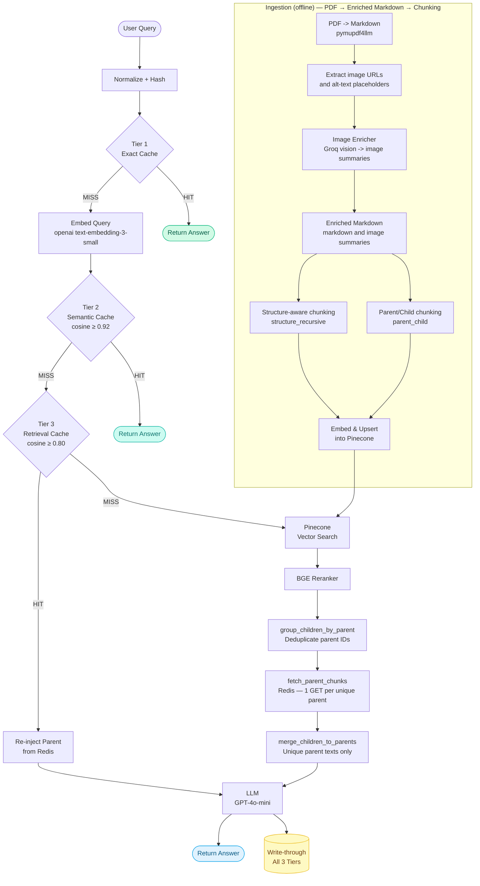
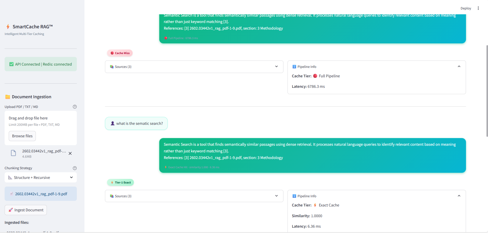
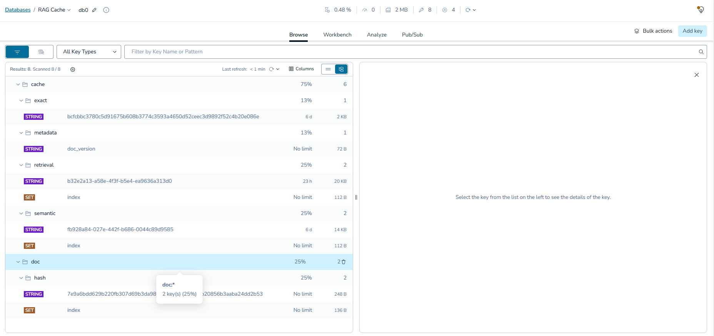
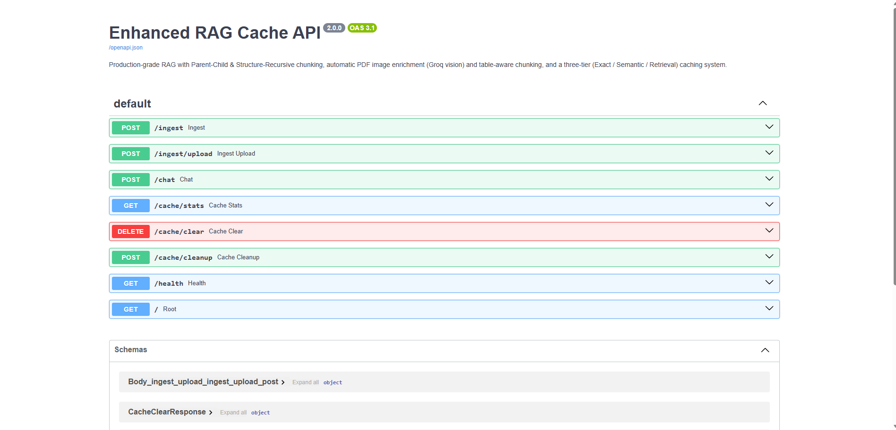

# ⚡ Enhanced RAG Cache

> Production-grade RAG · Parent-Child chunking · 3-Tier intelligent caching · Pinecone + Redis + OpenAI

---

## Flow



---

## Project Structure

```
enhanced_rag_cache/
├── api.py                      # FastAPI routes (ingest, chat, /documents, stats)
├── main.py                     # Uvicorn entry point
├── config.yaml                 # All tunable parameters
├── docker-compose.yml          # Redis
├── src/
│   ├── pipeline.py             # 3-tier cache → retrieval → LLM orchestration
│   ├── ingestion.py            # PDF enrichment + chunking + Pinecone upsert
│   ├── chunking/
│   │   ├── parent_child.py         # Large parents (Redis) + small children (Pinecone)
│   │   └── structure_recursive.py  # Header-aware + recursive fallback
│   ├── caching/
│   │   ├── cache_manager.py        # Tier 1 / 2 / 3 orchestrator
│   │   ├── redis_backend.py        # Redis implementation
│   │   ├── sqlite_backend.py       # SQLite fallback
│   │   ├── parent_cache.py         # Parent chunk store (Redis)
│   │   └── redis_client.py
│   ├── retrieval/
│   │   ├── retriever.py            # Pinecone vector search
│   │   ├── reranker.py             # BGE reranking + parent merge
│   │   ├── parent_merger.py        # group → deduplicate → fetch parents
│   │   └── pinecone_manager.py
│   ├── generation/
│   │   └── generator.py            # GPT-4o-mini answer synthesis
│   └── utils/
│       ├── embeddings.py           # OpenAI text-embedding-3-small
│       ├── pdf_to_markdown.py      # pymupdf4llm
│       ├── image_enricher.py       # Groq vision image descriptions
│       └── config_loader.py
├── frontend/
│   └── app.py                  # Streamlit UI
├── screenshots/
│   ├── rag_cache.png
│   ├── rag_cache_redis.png
│   ├── rag_cache_swagger.png
│   └── demo_rag_cache.mp4
└── data/                       # Drop documents here
```

---

## Quick Start

```bash
# 1. Install
pip install -r requirements.txt

# 2. Configure
cp .env.example .env   # fill PINECONE_API_KEY + OPENAI_API_KEY

# 3. Redis
docker-compose up -d

# 4. API
python main.py          # → http://localhost:8000/docs

# 5. UI (separate terminal)
cd frontend && streamlit run app.py   # → http://localhost:8501
```

---

## Stack

| | |
|---|---|
| Vector DB | Pinecone (integrated embedding) |
| Cache | Redis 7 · 3-tier (Exact / Semantic / Retrieval) |
| LLM | OpenAI GPT-4o-mini |
| Embeddings | OpenAI text-embedding-3-small |
| Reranker | Pinecone BGE-reranker-v2-m3 |
| PDF | pymupdf4llm + Groq vision |
| API | FastAPI + Uvicorn |
| UI | Streamlit |

---

## API

| Method | Endpoint | |
|---|---|---|
| `POST` | `/ingest` | Ingest by file path |
| `POST` | `/ingest/upload` | Upload + ingest |
| `GET` | `/documents` | List ingested documents |
| `POST` | `/chat` | Query (3-tier cache aware) |
| `GET` | `/cache/stats` | Cache analytics |
| `DELETE` | `/cache/clear` | Wipe all caches |
| `GET` | `/health` | Health check |

---

## Screenshots

### UI


### Redis Cache


### Swagger


### Demo
> 📹 [`demo_rag_cache.mp4`](screenshots/demo_rag_cache.mp4)
