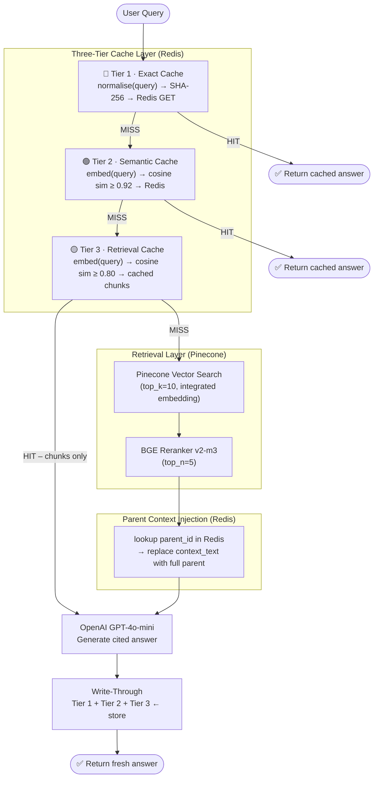

# Architecture Document — Enhanced RAG Cache

## 1. System Architecture Diagram



---

## 2. Chunking Strategy Explanation

### 2a. Strategy 1 — Parent-Child Chunking

**File:** `src/chunking/parent_child.py`

#### How it works

| Level | Size | Overlap | Storage | Purpose |
|---|---|---|---|---|
| **Parent** | 1 500 chars | 100 chars | Redis | LLM context window |
| **Child** | 300 chars | 50 chars | Pinecone | Retrieval precision |

1. The document text is split into large **parent chunks** using `RecursiveCharacterTextSplitter` with `["\n\n", "\n", ". ", " ", ""]`.
2. Each parent is further split into small **child chunks** using the same splitter.
3. Child chunks carry a `parent_id` metadata field linking them back to their parent.
4. At index time: child chunk records are upserted to Pinecone; parent dicts are stored in Redis with key `rag_cache:parent:<parent_id>`.
5. At query time: Pinecone returns child chunk hits → each hit's `parent_id` is used to look up the full parent text from Redis → the parent text (not the narrow child) is passed to the LLM as `context_text`.

**Metadata linking example:**

```
Parent: "report.pdf::parent_3"  (stored in Redis, 1500 chars)
 └── Child: "report.pdf::parent_3::child_0"  (indexed in Pinecone, 300 chars)
 └── Child: "report.pdf::parent_3::child_1"
 └── Child: "report.pdf::parent_3::child_2"
```

### 2b. Strategy 2 — Structure-Aware + Recursive Chunking

**File:** `src/chunking/structure_recursive.py`

#### How it works

**Phase 1 — PDF → Markdown**  
`pymupdf4llm.to_markdown()` converts the PDF into clean Markdown that preserves heading hierarchy, tables, bold/italic, and paragraph breaks. For TXT/MD files the raw content is used as-is.

**Phase 2 — Header-based splitting**  
`MarkdownHeaderTextSplitter` splits the Markdown along H1→H4 boundaries. Each resulting section becomes a candidate chunk. Heading hierarchy is stored as metadata fields (`h1`, `h2`, `h3`, `h4`) for rich filtered retrieval.

**Phase 3 — Recursive fallback for oversized sections**  
Any section exceeding `max_section_size` (default 1 200 chars) is passed through `RecursiveCharacterTextSplitter` using the separator hierarchy `["\n\n", "\n", ". ", " ", ""]`. Sub-chunks inherit the parent section's heading metadata.

#### When to use which strategy

| Scenario | Recommended Strategy |
|---|---|
| Arbitrary PDFs, annual reports, books | **Parent-Child** — works regardless of formatting quality |
| Well-structured docs (technical manuals, Markdown wikis, RFCs) | **Structure-Recursive** — leverages author-defined topic boundaries |
| Need heading metadata for filtered search | **Structure-Recursive** |
| Need dense, uniform chunk size distribution | **Parent-Child** |

---

## 3. Caching Architecture

### 3a. Tier 1 — Exact Cache

**File:** `src/caching/exact_cache.py`

**Data stored:**  
`rag_cache:exact:<sha256>` → JSON `{answer, sources, cached_at}`

**Hit condition:**  
`normalise(incoming_query) == normalise(cached_query)`  
Normalisation: lowercase → strip → collapse whitespace → strip trailing `?.!`

**TTL:** 24 hours (configurable)

**Use case:** Repeated verbatim questions from the same or different users (e.g. FAQ scenarios). Zero latency hit — no embedding, no network call.

---

### 3b. Tier 2 — Semantic Cache

**File:** `src/caching/semantic_cache.py`

**Data stored:**
- `rag_cache:semantic:index` → Redis Hash `{entry_id → {query, cached_at}}`
- `rag_cache:semantic:emb:<entry_id>` → JSON embedding vector (1 536 floats)
- `rag_cache:semantic:payload:<entry_id>` → JSON `{answer, sources}`

**Hit condition:**  
`cosine_similarity(embed(incoming_query), cached_embedding) ≥ 0.92`

**Embedding model:** OpenAI `text-embedding-3-small` (1 536 dims, called once per query)

**Eviction:** LRU by `cached_at` timestamp when `max_entries` (default 1 000) is reached; TTL-based expiry (12 hours) cleans stale entries automatically.

**Use case:** Paraphrased questions — "What was the revenue?" → "How much money did the company make?" both hit the same cached answer.

---

### 3c. Tier 3 — Retrieval Cache

**File:** `src/caching/retrieval_cache.py`

**Data stored:**
- `rag_cache:retrieval:index` → Redis Hash `{entry_id → meta}`
- `rag_cache:retrieval:emb:<entry_id>` → JSON embedding vector
- `rag_cache:retrieval:chunks:<entry_id>` → JSON list of chunk dicts

**Hit condition:**  
`cosine_similarity(embed(incoming_query), cached_embedding) ≥ 0.80`

**On hit:** The cached chunk list is returned directly. The reranker's parent-context injection still runs (looks up Redis). Only the LLM call is made — Pinecone search is skipped.

**TTL:** 6 hours (configurable)

**Use case:** Related questions that would retrieve the same document sections — "Summarise Section 3" / "What does Section 3 say?" both reuse the same chunk set and only differ in the generated prose.

---

### 3d. Parent Chunk Cache

**File:** `src/caching/parent_cache.py`

**Data stored:**  
`rag_cache:parent:<parent_id>` → JSON `{parent_id, doc_id, source, text, index}`

**TTL:** 7 days (parents are static per document unless re-ingested)

**Purpose:** Allows `reranker.py` to inject full parent context without an extra Pinecone query. Populated at ingest time, keyed by `parent_id`.

---

### 3e. Cache Invalidation Strategy

| Cache | Invalidation |
|---|---|
| Exact | Key-level delete by query; `DELETE /cache/clear` wipes all |
| Semantic | TTL expiry + LRU eviction at capacity; manual flush via API |
| Retrieval | TTL expiry + LRU eviction; manual flush via API |
| Parent | TTL (7 days); re-ingesting a document with the same `doc_id` overwrites entries |

Re-ingestion does **not** automatically clear Tier 1/2/3 caches for that document — this is intentional. Call `DELETE /cache/clear` after a document update if stale answers must be removed immediately.

---

## 4. Design Decisions & Trade-offs

### 4a. Caching Backend — Redis

**Chosen over in-memory dict** because:
- Survives API server restarts (durable within Redis persistence mode)
- Shareable across multiple API worker processes (uvicorn `--workers N`)
- Built-in TTL, atomic operations, pipelining (batch writes)
- Near-zero operational overhead with Docker

**Chosen over SQLite** because:
- Sub-millisecond read/write for cache lookups (vs ~0.5–2 ms for SQLite)
- Natural support for TTL without a background cleanup job
- Hash and string data structures map directly to our cache key design

**Trade-off:** Requires a running Redis instance. The application gracefully degrades — if Redis is unreachable all three cache tiers are silently disabled and every query runs the full pipeline.

### 4b. Embedding for Cache — OpenAI text-embedding-3-small

**Chosen over Pinecone integrated embedding** for cache tiers because:
- Pinecone integrated embedding works through the upsert/search API and cannot return a raw vector for arbitrary strings outside of upsert context
- OpenAI `text-embedding-3-small` is inexpensive ($0.02 / 1M tokens) and fast (~50 ms)
- 1 536-dimensional vectors give good cosine similarity discrimination

**Trade-off:** One additional OpenAI API call per query for Tier-2/3 lookups. This is justified because a Tier-2/3 hit saves the much more expensive Pinecone search + LLM call.

### 4c. Cache Warming & Cold Starts

On first deployment the caches are empty. Every query runs the full pipeline and populates all three tiers as a side-effect (write-through on every full pipeline run). No explicit cache warming is needed.

For a controlled warm-up, run a representative set of queries against the API before directing real user traffic — the cache self-populates.

### 4d. Parent Context vs Child Retrieval

The parent-child split (1 500 / 300 chars) was chosen based on:
- **Child size** ≤ 300 chars: ensures the embedding captures a tight semantic unit, improving retrieval precision
- **Parent size** 1 500 chars: provides ~5× more context to the LLM while staying well within typical prompt budgets

---

## 5. Query Flow Walkthrough

### Scenario A — Complete Cache Miss (first-ever query)

```
User: "What was the company's revenue in Q4?"

1. Tier-1 Exact  → MISS (normalised key not in Redis)
2. Tier-2 Semantic → MISS (no embeddings stored yet)
3. Tier-3 Retrieval → MISS (no chunk sets stored yet)
4. Pinecone search (top_k=10, integrated embed of query)
5. BGE reranker → top_n=5 chunks
6. For each child chunk: lookup parent_id in Redis → inject parent text as context_text
7. OpenAI GPT-4o-mini → generate cited answer
8. Write-through:
   • Tier-1: store normalised_query → {answer, sources}  TTL 24h
   • Tier-2: store embedding + payload  TTL 12h
   • Tier-3: store embedding + chunks  TTL 6h
9. Return answer to user  (typical: 1 500–3 000 ms)
```

### Scenario B — Tier-1 Exact Hit

```
User (same session or different user): "What was the company's revenue in Q4?"

1. Tier-1 Exact → HIT (SHA-256 key matches)
2. Return cached {answer, sources}  (typical: 5–15 ms)
```

### Scenario C — Tier-2 Semantic Hit

```
User: "How much revenue did the company earn in the fourth quarter?"

1. Tier-1 Exact → MISS  (different string)
2. Tier-2 Semantic → embed query (~50 ms OpenAI API call)
   → cosine_similarity with "What was the company's revenue in Q4?" = 0.947 ≥ 0.92
   → HIT
3. Return cached answer  (typical: 60–120 ms including embedding call)
```

### Scenario D — Tier-3 Retrieval Hit

```
User: "Can you explain the Q4 earnings?"

1. Tier-1 Exact → MISS
2. Tier-2 Semantic → best_sim = 0.84 < 0.92 → MISS
3. Tier-3 Retrieval → sim = 0.83 ≥ 0.80 → HIT
   → Load cached 5 chunk dicts from Redis
   → Re-run parent context injection (Redis look-ups only, no Pinecone)
4. OpenAI GPT-4o-mini → generate fresh answer from cached chunks
5. Write-through stores new query embedding for future lookups
6. Return answer  (typical: 400–800 ms — only LLM call, no Pinecone)
```
